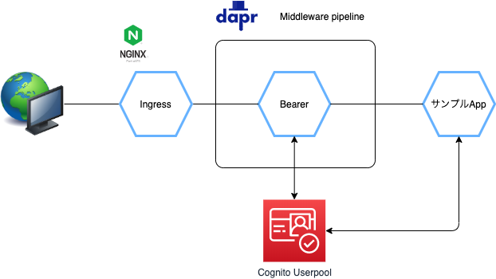

サンプル
=====

# 構成



# サンプルアプリケーションのビルド

## ビルド方法

```
$ mvn clean install
$ cd example
$ export OIDC_ISSUERURL=https://cognito-idp.<REGION>.amazonaws.com/<POOL ID>
$ gradle clean build
$ docker build . -t example
$ docker run -e OIDC_ISSUERURL=$OIDC_ISSUERURL -p 8080:8080 example
```

## テスト

```
curl -H 'Authorization: Bearer <ID Token>' http://localhost:8080/hello
```
